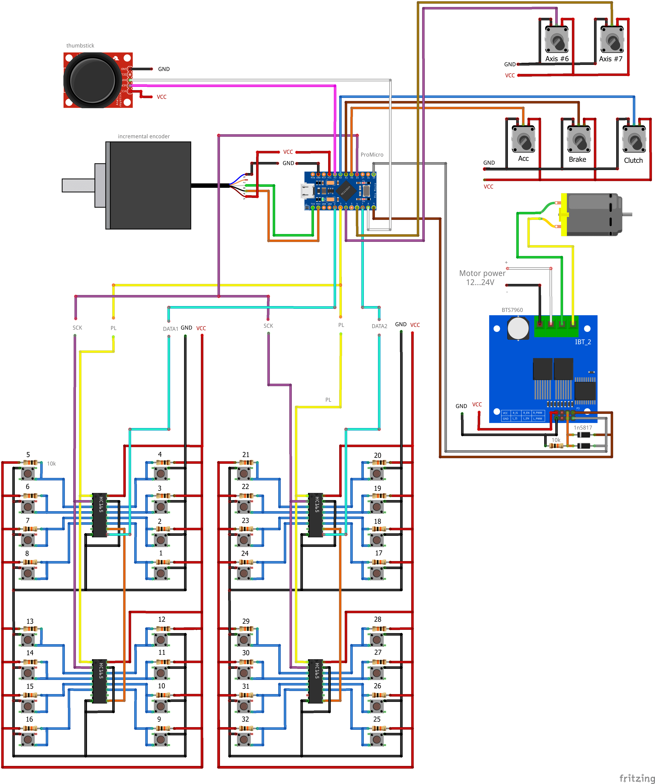
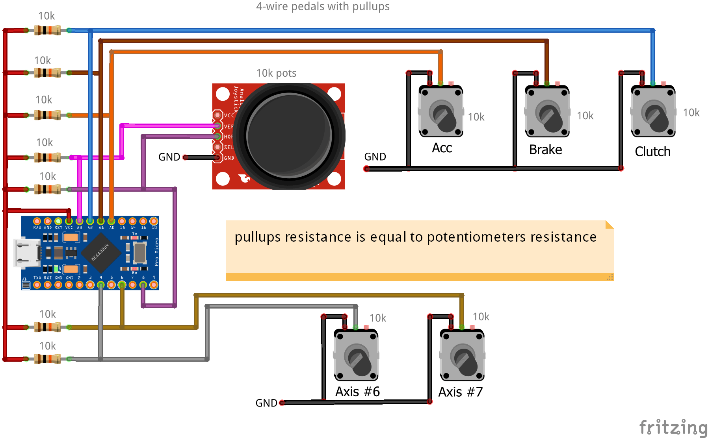
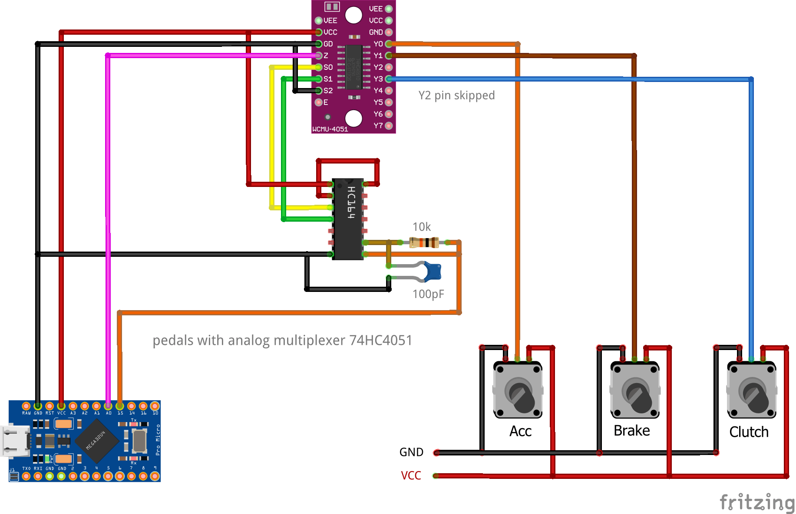
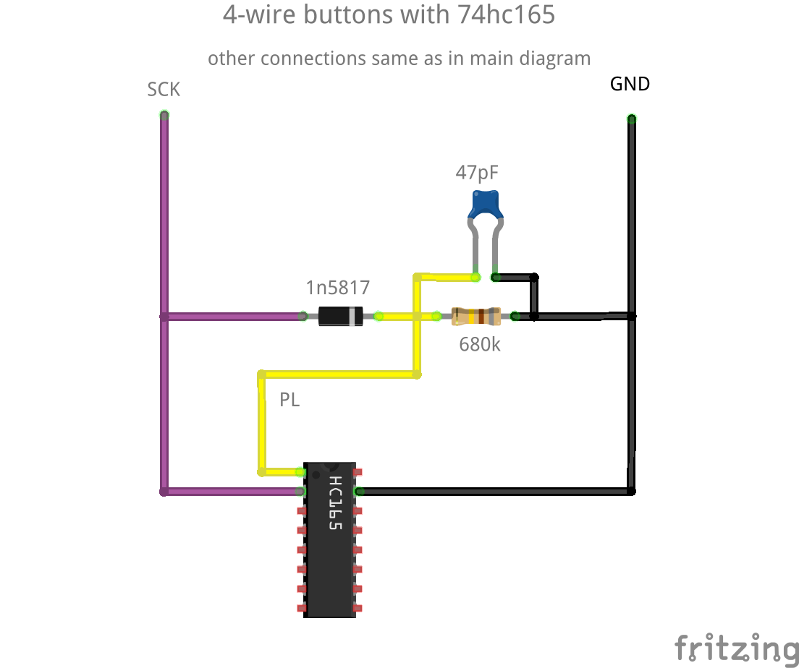

# AFFBWheel (Arduino Force FeedBack Wheel)

Это проект контроллера руля с обратной связью на Arduino.

- 6 осей: руль (X), газ (Y), тормоз (Z), сцепление (Rx), и еще две дополнительно (Ry, Rz) (например для стика).
- 32 кнопки. 
- Эффекты обратной связи - весь набор: constant/ramp/square/sine/triangle/sawtooth/spring/damper/inertia/friction
- Диапазон руля можно менять: 1080/900/360/270/180 градусов, и вообще любое значение.

К сожалению, не удалось найти достаточно информации о некоторых эффектах, возможно, моя реализация неверна.  
Впрочем, современные игры как правило, используют только эффект постоянного усилия.

В проекте использован код коммуникации USB HID из проекта [VNWheel](https://github.com/hoantv/VNWheel).

## Оборудование:

- Arduino на контроллере Atmega32U4 (Leonardo, ProMicro, Micro, и др.)
- инкрементальный энкодер или TLE5010/AS5600+магнит
- потенциометры для аналоговых осей (или датчики холла)
- сдвиговые регистры 74HC165 для кнопок (или i2c-расширители MCP23017)
- драйвер BTS7960
- двигатель постоянного тока
- источник питания для двигателя
- опционально: АЦП MCP3204, ADS1015, или аналоговый мультиплексор 74HC4051/74HC4052/74HC4067 + сдвиговый регистр 74HC164

### Схема подключений:



Для удобства подключений кнопки разделены на две линии по 16 кнопок.  
Таким образом, можно, например, поместить 16 штук на руль, и еще 16 - на коробку передач или базу.

#### PPR энкодера

Укажите PPR энкодера в файле config.h, в строке `#define ENCODER_PPR 400`.

#### Блокировочные конденсаторы


Для защиты от помех по питанию желательно добавлять блокировочные конденсаторы (керамические емкостью 0.1-1мкф между VCC и GND) на каждую микросхему (TLE5010, 74HC165, 74HC4052, MCP2304...) поближе к выводам микросхемы. На модулях такие конденсаторы уже имеются.

#### [Альтернативные варианты оборудования](#althw).

### ПО для тестирования:
- [VKB joystick tester](https://vkbcontrollers.com/?page_id=4609)
- [VKB button tester](https://vkbcontrollers.com/?page_id=4609)
- [FEdit](https://gimx.fr/wiki/index.php?title=Force_Feedback)

## Конфигурация

Опции конфигурации находятся в файле config.h.  
В основном они относятся к разным вариантам подключений (см.[ниже](#althw))

## Настройки и команды.

Изменяемые настройки руля можно менять с помощью [GUI](https://github.com/vsulako/AFFBWHeelGUI) или команд по последовательному порту (Serial monitor в Arduino)  
Большинство команд, если не указан параметр, выводит текущее значение.

- `center`  
Устанавливает текущее положение руля как центр. (происходит при старте)

- `centerbtn`  
`centerbtn <button>`  
Показать/изменить кнопку центровки.  
`<button>` - номер кнопки, 1-32. Установка в 0 означает отсутствие кнопки центровки.  
Этой командой можно назначить одну из кнопок для выполнения команды центровки (см. выше). Назначенная кнопка будет исключена из опроса.

- `range`  
`range <degrees>`  
Показать/изменить градусы руля

- `axisinfo <axis>`  
Включить вывод данных (положение оси и другие ее параметры) по одной из осей.  
Номера осей:  
**0** - **руль**  
**1** - **газ**  
**2** - **тормоз**  
**3** - **сцепление**  
**4** - **доп ось 1**  
**5** - **доп ось 2**  
**значение отсутствует** - **выключить вывод**  
Вывод данных тормозит работу, так что не забывайте отключать.

- `limit <axis>`  
`limit <axis> <min> <max>`  
Показать/установить минимальные/максимальные значения для аналоговой оси (аналоговые оси - все кроме руля).  
номера осей см. выше.

- `axiscenter <axis>`  
`axiscenter <axis> <pos>`  
Показать/установить центральное положение для аналоговой оси.  
Бывает нужно, если у оси есть центральное положение (например, ось стика. у педалей центра нет) и ось при установке в центр рапортует о положении не в центре.  
Пример: при стике в центре ось принимает raw значение не 512 как должно быть, а 530, и соответственно бывает чуть смещена от 0. Установите центр в 530 и ось в этом положении будет показывать 0.  
Чтобы отключить центр, выставите его в положение за пределами минимума/максимума, тогда центр будет определяться как средняя точка между минимумом и максимумом.

- `axisdz <axis>`  
`axisdz <axis> <dz>`  
Показать/установить мертвую зону центра для аналоговой оси.  
Если для оси установлено центральное положение (см.выше), можно добавить мертвую зону в центр.  
Пример: центр оси установлен в 530, а мертвая зона в 10. Теперь ось будет сообщать значение 0 когда показания будут находиться между 520 и 540.  
Это касается только центра. Мертвая зона не работает, если центр оси отключен.  
Чтобы установить мертвые зоны по краям, устанавливайте минимум/максимум несколько меньше чем реальные границы.

- `autolimit <axis>`  
Вкл/выкл автоматическую установку минимума/максимума для аналоговой оси.  
Если это включено, то при любом превышении существующих границ текущее значение становится новой границей.  
(Иначе говоря: включите, прожмите педаль до упора и назад, выключите - готово, границы определены)  
Центральное положение и мертвая зона будут отключены.

- `debounce <count>`  
Показать/установить значение антидребезга для кнопок.  
Если это значение больше 0, кнопки будут регистрировать изменения только после <count> циклов (1 цикл - около 1мс)  
Если у кнопок проблема с дребезгом - попробуйте увеличить это значение.

- `gain <effectNum>`  
`gain <effectNum> <value>`  
Показать/установить коэффициент усиления для определенного эффекта.  
Номера эффектов:  
**0** - **общий** (влияет на все эффекты кроме endstop),  
**1** - **constant**,  
**2** - **ramp**,  
**3** - **square**,  
**4** - **sine**,  
**5** - **triangle**,  
**6** - **sawtoothdown**  
**7** - **sawtoothup**  
**8** - **spring**  
**9** - **damper**  
**10** - **inertia**  
**11** - **friction**  
**12** - **endstop** (сила, возвращающая руль обратно при достижении границы диапазона)  
Значение по умолчанию - 1024, что соответствует 100%.  
2048 = 200%, 512 = 50% и так далее.

- `forcelimit <minforce> <maxforce> <cutforce>`  
Показать/установить минимальное/максимальное значение ШИМ для обратной связи и уровень обрезки усилия. Диапазон значений 0...16383.  
Если усилие не нулевое, его значение будет пересчитано из диапазона [1..16383] в [minforce...maxforce].  
Чтобы избежать рывка при переходе от отрицательного усилия к положительному и наоборот, наличествует небольшая переходная зона.  
Далее, если результирующее значение больше чем значение `<cutforce>` - значение усилия будет обрезано на уровне `<cutforce>`.  
Значения по умолчанию - `minforce=0`, `maxforce=16383`, `cutforce=16383` (т.е. без изменений)

- `maxvd`  
`maxvd <value>`  
Показать/установить максимальное значение скорости для эффекта демпфера.  
(принцип вычисления эффекта требует задания значения скорости, которому будет соответствовать максимальное усилие)  
При увеличении этого параметра эффект демпфера ослабевает, и наоборот.

- `maxvf`  
`maxvf <value>`  
Показать/установить максимальное значение скорости для эффекта трения.  
оказывает воздействие только на действие эффекта для малых значений скорости.

- `maxacc`  
`maxacc <value>`  
Показать/установить максимальное значение ускорения для эффекта инерции.  
При увеличении этого параметра эффект инерции ослабевает, и наоборот.

- `ffbbd`  
`ffbbd <value>`  
Показать/установить разрядность ШИМ обратной связи.  
Знак игнорируется: разрядность 8 означает что абсолютное усилие может принимать 256 значений от 0 до максимума, таким образом весь диапазон составляет [-255..0..255].  
Разрядность влияет на частоту ШИМ: freq = 16000000 / 2^(bitdepth+1)  
Рассчитанные значения:  
**8**: 31.25 кГц  
**9**: 15.625 кГц  
**10**: 7.8 кГц  
**11**: 3.9 кГц  
**12**: 1.95 кГц  
**13**: 0.97 кГц  
**14**: 0.48 кГц  
Значение по умолчанию - 9, частота 15.625кГц. Менять его не следует.  
Значения больше 9 приводят к уменьшению частоты и возникновению противного писка.  
Меньшие значения - только теряют в разрешении.  
Настройка оставлена просто на всякий случай.

- `save`  
Сохранить настройки в EEPROM.  
Настройки, изменяемые при помощи команд, будут действовать только до сброса.  
Используйте эту команду чтобы их сохранить в постоянную память.

- `load`  
Загрузить настройки из EEPROM.  
Происходит при старте.  
При обнаружении ошибки в данных, загружаются настройки по умолчанию.

- `defaults`  
Загрузить настройки по умолчанию.

- `timing`  
вкл/выкл отладочный вывод времени (в мкс) исполнения разных процедур, а также количество циклов в секунду.  
S - время чтения позиции руля  
A - время чтения аналоговых осей  
B - время чтения кнопок  
U - время коммуникации по USB  
F - время расчета обратной связи  
loop/sec - кол-во циклов в секунду.

- `fvaout`  
вкл/выкл отладочный вывод значений усилия обратной связи, скорости и ускорения руля в оси Rx, Ry, Rz.  
Это значительно быстрее чем вывод в последовательный порт.


<a name="althw"></a>
## Альтернативные конфигурации оборудования.

### Arduino Leonardo вместо ProMicro:


На Leonardo не обозначены пины 14,15,16.
Там они находятся на коннекторе ICSP, это MISO, SCK, и MOSI.
В остальном подключения не отличаются от ProMicro, изменений в коде не требуется.

### Альтернативные варианты подключения руля

#### TLE5010
TLE5010 это цифровой датчик поворота магнита. Можно использовать вместо энкодера.

Схема: 

[полная схема](images/base_TLE5010.png)

Установка магнита по отношению к TLE5010:


Магнит устанавливается в центре торца оси руля, и напротив него на расстоянии в несколько мм TLE5010.
Магнит должен быть ориентирован на микросхему линией разделения полюсов.

Изменения в config.h:

- раскомментируйте `#define STEER_TYPE ST_TLE5010`
- закомментируйте остальные строки со `STEER_TYPE`

#### AS5600

AS5600 - цифровой датчик поворота магнита с интерфейсом I2C. Используется аналогично TLE5010.

Схема: 


Изменения в config.h:

- раскомментируйте `#define STEER_TYPE ST_AS5600`
- закомментируйте остальные строки со `STEER_TYPE`
- установите пины для I2C (можно использовать любые свободные) в строках:
	```cpp
	#define I2C_PIN_SDA 0
	#define I2C_PIN_SCL 1
	```
При использовании других I2C устройств (AD1015,MCP23017) - они подключаются параллельно к тем же пинам.

### Альтернативные варианты подключения педалей:

#### Вариант 1: подтяжки.

Количество проводов для подключения педалей снижается до 4.

Просто и дешево, но есть минусы.
- показания становятся нелинейными. Добавлена возможность пересчитывать их в линейные, но на это тратится некоторое время. 
- при таком подключении нельзя заменить потенциометры на датчики холла (нет линии VCC)
- подтяжки необходимо ставить на все аналоговые оси

Схема:  


Сопротивление резистора подтяжки должно быть равно сопротивлению потенциометра, если потенциометр на 10кОм то и подтяжку ставьте 10кОм.

Изменения в config.h:

- убедитесь что раскомментирована строка `#define PEDALS_TYPE PT_INTERNAL` и закомментированы остальные строки с `PEDALS_TYPE`.
- раскомментируйте `#define AA_INT_PULLUP` 
- раскомментируйте `#define AA_LINEARIZE`, если требуется пересчет в линейную характеристику

#### Вариант 2: аналоговый мультиплексор 74HC4051/74HC4052/74HC4067 + сдвиговый регистр 74HC164.

Также способ уменьшить количество проводов.

Схема:  
  
[Схема для 74HC4052](images/pedals_HC4052.png)  
[Схема для 74HC4067](images/pedals_HC4067.png)

Изменения в config.h:

- раскомментируйте `#define PEDALS_TYPE PT_MP_HC164` и закомментируйте остальные строки с `PEDALS_TYPE`

#### Вариант 3: внешний АЦП MCP3204

MCP3204 - достаточно быстрый 12-битный 4-канальный АЦП. 
Работает по 6 проводам, но можно добиться работы и по 5, и даже по 4 проводам.

Схемы:  
[6 проводов](images/pedals_MCP2304_6w.png)  
[5 проводов](images/pedals_MCP2304_5w.png)  
[4 провода v1](images/pedals_MCP2304_4w_v1.png)  
[4 провода v2](images/pedals_MCP2304_4w_v2.png)  
[4 провода v3](images/pedals_MCP2304_4w_v3.png)

Если используется TLE5010, линии соединяются параллельно:
 
[6 проводов + TLE5010](images/pedals_MCP2304_TLE5010_6w.png)  
[5 проводов + TLE5010](images/pedals_MCP2304_TLE5010_5w.png)  
[4 провода v1 + TLE5010](images/pedals_MCP2304_TLE5010_4w_v1.png)  
[4 провода v2 + TLE5010](images/pedals_MCP2304_TLE5010_4w_v2.png)

Изменения в config.h:

- Для 6 или 5 проводов:
	- раскомментируйте `#define PEDALS_TYPE PT_MCP3204_SPI` и закомментируйте остальные строки с `PEDALS_TYPE`
- Для 4 проводов:
	- раскомментируйте `#define PEDALS_TYPE PT_MCP3204_4W` и закомментируйте остальные строки с `PEDALS_TYPE`
	- укажите пины для SCK, MISO и MOSI соответственно выбранному варианту подключения (на схемах v1, v2, v3):
		- Для v1 (общие MOSI/MISO):
		```cpp
		#define MCP3204_4W_PIN_SCK	A0
		#define MCP3204_4W_PIN_MOSI	16
		#define MCP3204_4W_PIN_MISO	14
		```
		- Для v2: (общий SCK)
		```cpp
		#define MCP3204_4W_PIN_SCK	15
		#define MCP3204_4W_PIN_MOSI	A0
		#define MCP3204_4W_PIN_MISO	A0
		```
		- Для v3: (раздельное подключение)
		```cpp
		#define MCP3204_4W_PIN_SCK	A0
		#define MCP3204_4W_PIN_MOSI	A1
		#define MCP3204_4W_PIN_MISO	A1
		```

#### Вариант 4: внешний I2C АЦП ADS1015

Схема:  


Этот АЦП относительно медленный (~0.3мс на преобразование), поэтому значения осей будут читаться по одной за цикл, что приводит к втрое меньшей частоте чтения.  
Также, в нем фиксированные уровни опорного напряжения (используется ±2.048в) так что при питании 5в на осях будут мертвые зоны в ~10% по краям диапазона.
Если требуется использовать полный диапазон потенциометра, то это можно компенсировать, если добавить по паре дополнительных резисторов ([схема](images/pedals_ADS1015_resistors.png)) на каждый потенциометр (сопротивление подбирать, начать с 1/10 от сопротивления потенциометра).  
Или же обеспечить питание потенциометров на уровне 4.1в (например, с помощью TL431 - [схема](images/pedals_ADS1015_TL431.png)). 

Изменения в config.h:
- раскомментируйте `#define PEDALS_TYPE PT_ADS1015` и закомментируйте остальные строки с `PEDALS_TYPE`
- установите пины для I2C (можно использовать любые свободные) в строках:
	```cpp
	#define I2C_PIN_SDA 2
	#define I2C_PIN_SCL 7
	```
При использовании других I2C устройств (AS5600,MCP23017) - они подключаются параллельно к тем же пинам.

### Альтернативные варианты подключения кнопок.

#### Вариант 1: 74HC165 по 4 проводам

Можно избавиться от провода PL (от 74HC165 до Arduino) и сократить количество проводов до 4.

Cхема:  


Изменения в config.h:
- убедитесь что раскомментирована строка `#define BUTTONS_TYPE BT_74HC165` и закомментированы остальные строки с `BUTTONS_TYPE`
- закомментируйте строку `#define PIN_BPL 3`

#### Вариант 2: I2C-расширители MCP23017.

Схема:  


Изменения в config.h:
- раскомментируйте  `#define BUTTONS_TYPE BT_MCP23017` и закомментируйте остальные строки с `BUTTONS_TYPE`
- установите пины для I2C (можно использовать любые свободные) в строках:
	```cpp
	#define I2C_PIN_SDA 2
	#define I2C_PIN_SCL 7
	```
При использовании других I2C устройств (AS5600,AD1015) - они подключаются параллельно к тем же пинам.


